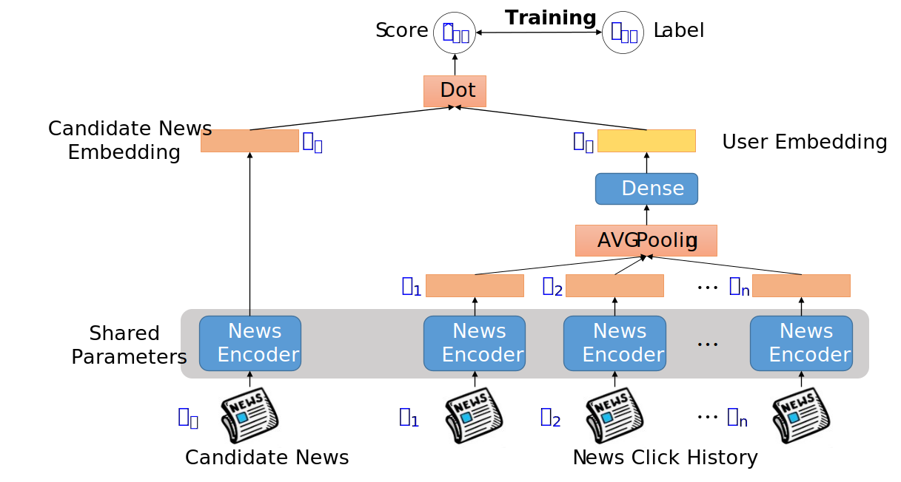
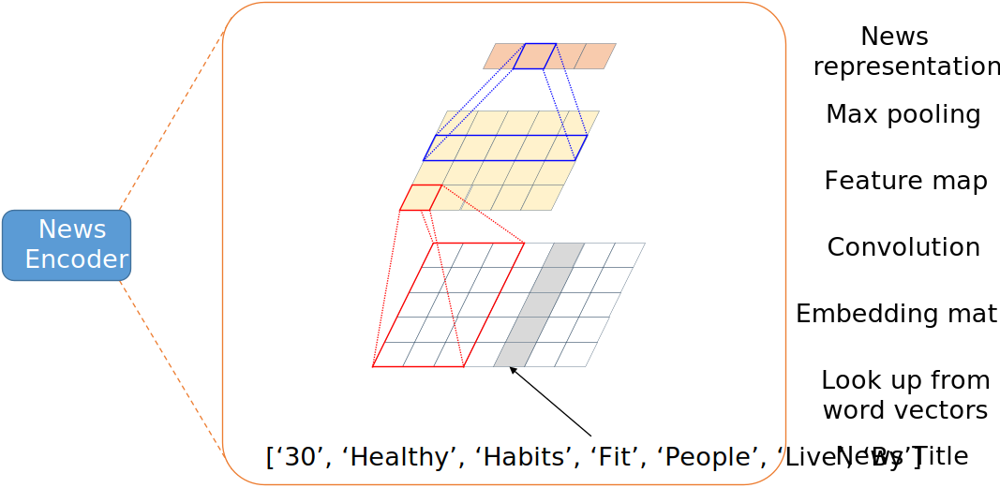

# BJTU Web Search & Recommendation 2023 (M502075B/C402005B)

Demo code for news click-through rate prediction competition.

## Base Model

#### 1.  Framework

The framework of base model for news recommendation, it consists of several parts: (1) a news encoder that uses rich textual content to learn news embeddings, and all news encoder parameters are shared; (2) a cheap sequential behavior moduel learns user embeddings from news click history; (3) a prediction  moduel calculates predictive scores using the dot product of user embeddings with candidate news embeddings.



#### 2. News Encoder



Note: only the title information is used in this demo.

## Usage

We recommend developing this repository on Linux.

1. Clone this repository
    ```shell
    git clone https://github.com/nipirennipi/BJTU-M502075B-2023
    cd BJTU-M502075B-2023
    ```
2. Download dataset
      - Link1: https://www.aliyundrive.com/s/y9jegdc2nVG
      - Move them to the `data` folder
          ```
          └── data
              ├── train_behaviors.txt
              ├── test_behaviors_1.txt
              ├── news.txt
              └── ...
          ```
4. Download pre-trained word vectors
    ```shell
    cd data
    bash download.sh
    ```
5. Training and prediction
    ```shell
    cd ..
    bash run.sh
    ```

## Hints

- More Powerful News Encoder
- Sequential Behavior Modeling
- Training Strategy
- Data Imbalance

## Reading List

Some papers that might be helpful.

- **Survey**
    - Wu et al., **Personalized News Recommendation: Methods and Challenges**, TOIS 2023.
    - Zhang et al., **Deep Learning for Click-Through Rate Estimation**, IJCAI 2021.
- **Sequential Behavior Modeling**
    - Zhou et al., **Deep Interest Network for Click-Through Rate Prediction**, KDD 2018.

- **Prompt Learning**
    - Zhang et al., **Prompt Learning for News Recommendation**, SIGIR 2023.
    - Li et al., **PBNR: Prompt-based News Recommender System**, arXiv 2023.

